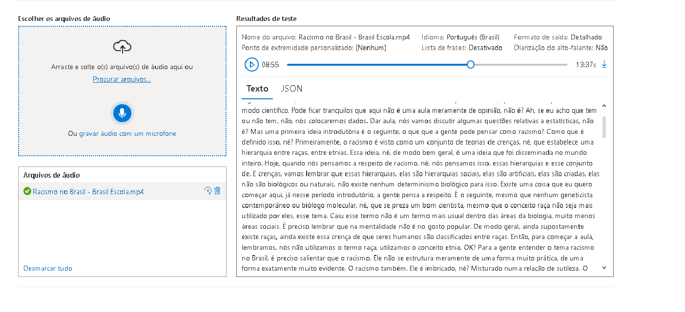

# Projeto: Azure Language Studio e Speech Studio

Este repositório contém um experimento utilizando os serviços **Azure Language Studio** e **Azure Speech Studio**.

## 📌 Introdução
O objetivo deste projeto foi testar e explorar as capacidades dos serviços cognitivos do Azure para processamento de linguagem natural e reconhecimento de fala.

## 🛠️ Serviços Utilizados
📃 Azure Language Studio – Processamento de Linguagem Natural (NLP)

Permite analisar, entender e processar textos automaticamente. Algumas possibilidades incluem:

Análise de Sentimentos → Avalia opiniões e classifica textos como positivo, negativo ou neutro.

Extração de Palavras-Chave → Identifica termos mais relevantes em documentos e mensagens.

Detecção de Linguagem → Reconhece o idioma de um texto automaticamente.

Tradução Automática → Integração com Azure Translator para tradução em tempo real.

Reconhecimento de Entidades Nomeadas (NER) → Identifica nomes, locais e empresas dentro de um texto.

Correção Gramatical e Ortográfica → Ajuda na revisão automática de textos.

Exemplo de Uso: Um sistema de suporte ao cliente pode usar esse serviço para analisar mensagens e detectar insatisfação automaticamente.

🔊 Azure Speech Studio – Processamento de Voz

Permite converter fala em texto e vice-versa. Alguns recursos incluem:

Conversão de Fala para Texto (Speech-to-Text) → Transcreve conversas e chamadas.

Conversão de Texto para Fala (Text-to-Speech) → Gera voz sintética realista a partir de um texto.

Tradução de Voz em Tempo Real → Permite conferências em diferentes idiomas.

Reconhecimento de Comandos de Voz → Uso em dispositivos IoT e assistentes virtuais.

Autenticação por Voz (Speaker Recognition) → Identifica e verifica usuários com base na sua voz.

Exemplo de Uso: Um call center automatizado pode transcrever chamadas, analisar sentimentos e responder automaticamente com assistentes de voz.

## 📂 Estrutura do Projeto
azure-language-speech-studio/
│── inputs/
│   ├── teste.txt  # Frases utilizadas para análise
│── README.md       # Documentação do projeto

## 🔬 Testes Realizados
Aqui estão alguns prints dos testes feitos:

*Teste de análise de sentimento usando o Azure Language Studio.*

*Teste de conversão de texto para fala usando Azure Speech Studio.*

## 🚀 Conclusão
Os serviços **Azure AI** são extremamente poderosos para processamento de linguagem natural e reconhecimento de fala. Durante os testes, foi possível identificar emoções nos textos e converter mensagens para áudio de maneira eficiente.

